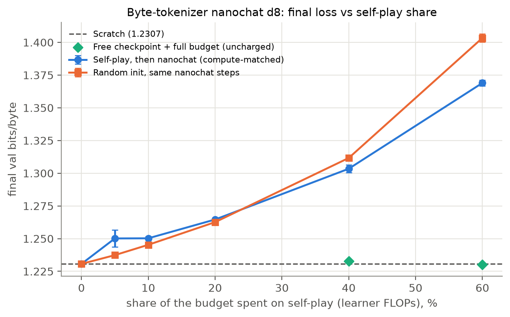
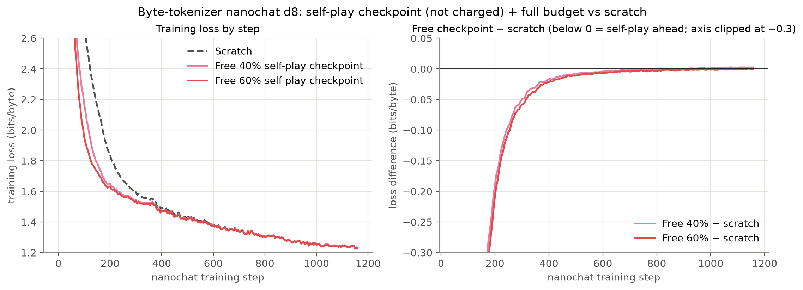
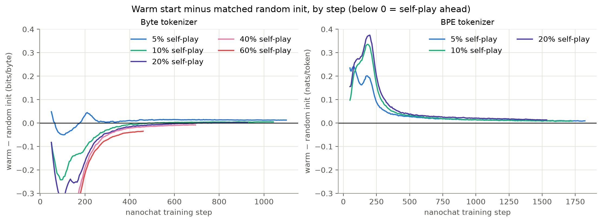

# Self-play pretraining at equal compute

A reimplementation of **Self-Play Pretraining with Zero Data**
(Cowsik, Dolev, Li, De Luca, Cohen, Goodman, Levine — arXiv:2609.30063), plugged into nanoGPT-style
training and into [karpathy/nanochat](https://github.com/karpathy/nanochat), nanoGPT's maintained successor.
The paper releases no code, so everything here is written from the paper's text.

The paper treats a self-play checkpoint as free and reusable. This repo asks a stricter question:
**if self-play has to come out of the same compute budget, does a self-play warm-up help?**

## Result

At this scale, **no**. Self-play gives a real head start that fades, not a better final model.

**nanochat d8 with a byte tokenizer** (26M params, 5.96e16 FLOPs; self-play charged only its learner-training
FLOPs; final val bits/byte, mean of 2 seeds; lower is better):

| self-play share (rounds) | self-play, then nanochat | random init, same nanochat steps | self-play init vs random init |
|---|---|---|---|
| 0% (scratch) | **1.2307** | — | — |
| 5% (~240) | 1.2501 | 1.2374 | +0.013 (worse) |
| 10% (~475) | 1.2502 | 1.2453 | +0.005 (worse) |
| 20% (~945) | 1.2646 | 1.2626 | +0.002 (worse) |
| 40% (~1,890) | 1.3034 | 1.3116 | **−0.008 (better)** |
| 60% (~2,830) | 1.3690 | 1.4033 | **−0.034 (better)** |

Self-play checkpoint treated as free, then nanochat for the full budget: **1.2328 (40%) and 1.2302 (60%) vs
1.2307 for scratch**, a tie. It leads by about 0.7 bits/byte at step 100 and is level by step ~800.





What else came out of it:
- **The tokenizer matters.** With nanochat's BPE tokenizer, self-play only ever trains the single-byte tokens,
  and the warm start is behind random init at every step and every share (5–20%: 0.9501–0.9617 vs scratch
  0.9445). Switching nanochat to byte tokens flipped the sign.
- **Out of distribution**, the byte-level warm start is a little better than matched controls at in-context copying
  (the paper's ICL claim), but the advantage is gone after full training.
- **At 1M params on Shakespeare** (bytes), none of eight warm-ups beat scratch at equal compute: Brainf*ck and
  stack-machine self-play, the paper's random-PCFG baseline, and hand-designed Dyck / induction / Zipf-word / mixed
  generators.

Caveats: small models (1M and 26M), 2 seeds on nanochat, one GPU. Self-play got up to ~2,800 rounds; the paper runs 8,192.

## What's implemented

| file | what |
|---|---|
| `bf.c`, `bf.py` | the paper's bounded Brainf*ck machine (appendix E): circular tape, mod-256 cells, unmatched brackets are no-ops, random input tape, step/output budgets, the 10 macro tokens |
| `stackm.c`, `stackm.py` | a second substrate (not in the paper): a bounded stack machine with arithmetic, dup/swap/over/rot, emit and loops (`--machine=stack`) |
| `model.py` | nanoGPT's GPT in Llama style (RMSNorm, RoPE, SwiGLU, byte vocab) with a forward-mode-AD-safe attention path |
| `selfplay.py` | the self-play loop: pool of fresh / MAP-Elites mutations / replay; learning-progress reward `|<∇L(y), P ⊙ (θ_⌊e/2⌋ − θ_e)>|` via one `torch.func.jvp` per micro-batch; GRPO + KL-to-uniform generator with importance ratios and expert iteration; FLOP accounting and budgets; Table 5 ablations |
| `pcfg_pretrain.py`, `synth.py` | the paper's random-PCFG baseline (appendix H) and hand-designed warm-ups (`--task=dyck\|induction\|zipf\|mix`) |
| `train.py`, `compute_matched.sh`, `compare.py`, `launch_*.sh` | 1M-scale compute-matched sweeps on Shakespeare bytes |
| `nanochat_learner.py` | runs self-play on nanochat's own GPT (built exactly as `base_train` builds it; nanochat's FLOP formula; manual attention for the JVP) |
| `nanochat_patch/` | a 22-line patch to nanochat's `scripts/base_train.py` (`--init-from`, `--seed`, per-eval JSONL) and a byte-level tokenizer builder |
| `nanochat_cm2.sh`, `nanochat_job.sh`, `nanochat_long.sh` | nanochat sweeps: scratch, warm starts, matched controls, free checkpoints, at most N jobs at once |
| `nanochat_ood_eval.py` | out-of-distribution bits/byte (Shakespeare, Python, arithmetic, number sequences, copying, BF outputs) |
| `report/` | result JSONs, per-step loss curves, figure script (`make_figs.py`), and the interactive report template (`build.py`) |

## Reproduce

```bash
pip install torch numpy          # plus a C compiler; bf.c / stackm.c are built on first import
python data/prepare_eval.py      # Shakespeare bytes + zero-shot eval sets

# 1M-scale compute-matched sweep (self-play fraction f of a FLOP budget, then byte-level training)
BUDGET=1e14 FRACS="0 0.05 0.1 0.25 0.5" SEEDS="0 1 2" DEVICE=cuda ./compute_matched.sh

# nanochat: clone karpathy/nanochat to ~/nanochat, set it up (uv sync, dataset, tokenizer), then
python nanochat_patch/apply_patch.py ~/nanochat/scripts/base_train.py
~/nanochat/.venv/bin/python nanochat_patch/make_byte_tokenizer.py ~/.cache/nanochat_bytes ~/.cache/nanochat
NANOCHAT_BASE_DIR=~/.cache/nanochat_bytes OUT=~/nc-bytes FRACS="0.05 0.1 0.2" ./nanochat_cm2.sh
NANOCHAT_BASE_DIR=~/.cache/nanochat_bytes OUT=~/nc-bytes FRACS="0.4 0.6" ./nanochat_long.sh

# figures
python extract_step_curves.py ~/nc-bytes ~/nc-cm > report/step_curves.json
python report/make_figs.py report/step_curves.json report/nanochat_bytes_results.json report/figs
```

`selfplay.py --check_reward=True` verifies the forward-mode reward against explicit autograd at round 2.
Self-play is memory-hungry on the nanochat learner; on one 141 GB H200, keep to about 4 concurrent jobs.
